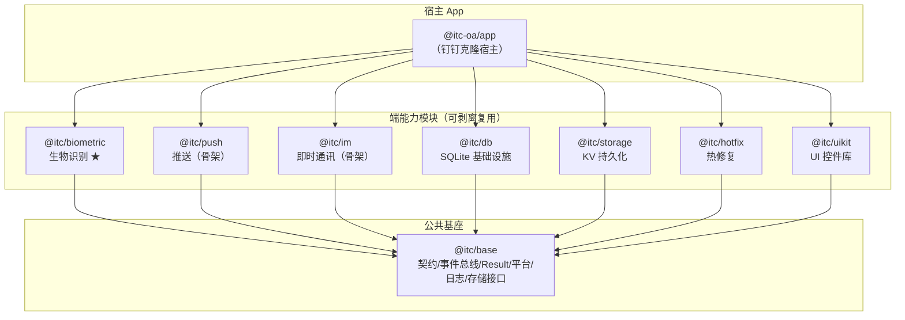

# OpenDingDing 项目说明文档

## 一、项目概述

**OpenDingDing** 是一个对标钉钉的**模块化 OA 移动应用**，基于 React Native 跨端框架构建，同时适配 **Android / iOS / 鸿蒙 NEXT** 三端。项目采用 pnpm monorepo 架构，将业务应用与端能力模块彻底解耦——生物识别、推送、即时通讯（IM）、本地数据库、KV 存储、热修复、UI 组件库等模块均可独立剥离，复用到其他 RN 项目中。

### 核心设计理念

- **模块化 & 可剥离复用**：每个 `@itc/*` 包（含 JS 层 + Android/iOS/鸿蒙原生代码）都是自包含的，可整包拷贝到其他项目独立使用。
- **依赖方向铁律**：`app → feature模块 → @itc/base`。`@itc/base` 绝不反向依赖任何 feature；feature 模块之间不互相依赖，仅通过 `@itc/base` 的契约接口和事件总线通信。
- **能力探测与降级**：每个端能力模块都实现统一的 `ItcModule` 契约（`isSupported()` / `init()` / `destroy()`），宿主可据此做三端差异化降级。

---

## 二、技术栈

| 维度 | 选型 | 版本/说明 |
|---|---|---|
| 跨端框架 | React Native | **0.82.1**（New Architecture） |
| 鸿蒙适配 | RNOH（React Native OpenHarmony） | `@react-native-oh/react-native-harmony` 0.82.30 |
| RN 架构 | **New Architecture** | TurboModules + Fabric 渲染器 + Codegen |
| 语言 | TypeScript / Kotlin / Swift+ObjC++ / ArkTS | — |
| 包管理 | **pnpm** workspaces | 11.2.2，`node-linker=hoisted` 模式 |
| UI 样式方案 | **Tamagui** v2 | 封装在 `@itc/uikit` 内部，对外不暴露 |
| 本地数据库 | **op-sqlite** + Drizzle ORM（可选） | SQLite 三端封装 |
| KV 存储 | **MMKV**（react-native-mmkv-storage） | 微信开源高性能 KV |
| 热修复 | **CodePush** | OTA JS Bundle 更新 |
| 原生构建 | react-native-builder-bob | 各 package 的 JS 构建工具 |
| 版本管理 | Changesets | 模块独立发版 |
| 运行环境 | Node.js ≥ 20 | — |

---

## 三、项目目录结构

```
OpenDingDing/
├── package.json                  # 根 monorepo 配置（workspace 脚本、changeset）
├── pnpm-workspace.yaml           # workspace 定义：packages/* + apps/*
├── pnpm-lock.yaml                # 依赖锁定
├── tsconfig.base.json            # 共享 TypeScript 配置
├── .npmrc                        # hoisted 布局 + @itc 私有源
├── .changeset/                   # Changesets 独立发版配置
│
├── apps/
│   └── oa/                       # 【宿主 App】@itc-oa/app
│       ├── package.json          # 依赖所有 @itc/* 模块 + RN 核心
│       ├── src/                  # JS/TS 源码
│       │   ├── App.tsx           # 应用入口（UIProvider + DemoScreen）
│       │   ├── screens/          # 业务页面
│       │   ├── db/               # 业务数据库 schema / repository
│       │   ├── utils/            # 工具函数
│       │   └── stubs/            # 类型桩
│       ├── android/              # Android 原生工程（Gradle）
│       ├── ios/                  # iOS 原生工程（Xcode + CocoaPods）
│       ├── harmony/              # 鸿蒙原生工程（DevEco Studio）
│       ├── vendor/bundle/        # 本地 CocoaPods（bundler 安装）
│       ├── metro.config.js       # Metro 打包配置（Android/iOS）
│       ├── metro.config.harmony.js # Metro 打包配置（鸿蒙）
│       └── scripts/              # 构建脚本（如鸿蒙端口转发）
│
├── packages/                     # 【可剥离复用的端能力模块】
│   ├── base/                     # @itc/base —— 公共基座
│   │   ├── src/
│   │   │   ├── contract.ts       # ItcModule 模块契约（生命周期接口）
│   │   │   ├── eventBus.ts       # 类型安全事件总线（跨模块解耦通信）
│   │   │   ├── result.ts         # Result<T, E> 类型（Rust 风格错误处理）
│   │   │   ├── platform.ts       # 三端平台判断（isAndroid/isIOS/isHarmony/select）
│   │   │   ├── logger.ts         # 日志抽象（可替换后端）
│   │   │   └── storage.ts        # KV 存储抽象接口 + setStorage/getStorage 代理
│   │   └── lib/                  # 构建产物
│   │
│   ├── biometric/                # @itc/biometric —— 生物识别 ★样板模块
│   │   ├── src/
│   │   │   ├── index.ts          # 指纹/人脸认证 + 生物绑定密钥签名
│   │   │   ├── types.ts          # 能力枚举、认证强度、密钥对等类型
│   │   │   └── NativeItcBiometric.ts  # TurboModule codegen spec
│   │   ├── android/              # Android 原生（指纹 + 人脸 + Keystore 签名）
│   │   ├── ios/                  # iOS 原生（FaceID/TouchID + Secure Enclave）
│   │   ├── harmony/              # 鸿蒙原生（指纹/人脸 + 密钥签名）
│   │   └── ItcBiometric.podspec  # iOS CocoaPods 规格
│   │
│   ├── push/                     # @itc/push —— 推送模块（占位骨架）
│   │   └── src/                  # 统一推送抽象（友盟/极光聚合 + APNs + Push Kit）
│   │
│   ├── im/                       # @itc/im —— 即时通讯模块（占位骨架）
│   │   └── src/                  # 封装 OpenIM SDK
│   │
│   ├── db/                       # @itc/db —— 本地 SQLite 基础设施
│   │   └── src/
│   │       ├── database.ts       # 打开/加密数据库
│   │       ├── migrations.ts     # 版本化迁移框架
│   │       ├── drizzle.ts        # Drizzle ORM 适配（可选）
│   │       └── types.ts          # 数据库层类型定义
│   │
│   ├── storage/                  # @itc/storage —— KV 持久化
│   │   └── src/
│   │       ├── index.ts          # 实现 @itc/base 的 KVStorage 接口
│   │       ├── mmkv.ts           # MMKV 原生封装（Android/iOS）
│   │       └── mmkv.harmony.ts   # MMKV 鸿蒙移植封装
│   │
│   ├── hotfix/                   # @itc/hotfix —— 热修复
│   │   ├── src/
│   │   │   ├── index.ts          # HotfixProvider 接口 + installHotfix() 代理
│   │   │   └── ItcHotfix.ts      # CodePush 实现
│   │   └── patches/              # CodePush RN 0.82 兼容补丁
│   │
│   └── uikit/                    # @itc/uikit —— 基础 UI 控件库
│       ├── src/
│       │   ├── index.ts          # 唯一出口，白名单导出（不暴露 tamagui）
│       │   ├── provider.tsx      # UIProvider（主题注入 + light/dark 切换）
│       │   ├── theme/            # 主题系统（颜色、模式上下文）
│       │   ├── components/       # 基础组件（Button/Text/Input/布局/表单/展示）
│       │   └── list/             # 列表组件
│       ├── tamagui/              # Tamagui 内部配置（不对外暴露）
│       └── patches/              # react-native-safe-area-context 兼容补丁
│
├── scripts/                      # 仓库级脚本
│   └── deref-rn-gradle-plugin.sh # 解引用 RN Gradle 插件软链接
│
└── docs/                         # 项目文档
    ├── 速查手册.md                # 三端环境 + 命令一页速查
    ├── 从零搭建-Android.md        # Android 从零搭建教程
    ├── 从零搭建-iOS.md            # iOS 从零搭建教程
    ├── 从零搭建-鸿蒙.md           # 鸿蒙从零搭建教程
    ├── 模块开发指南.md            # 如何开发一个新的 @itc 模块
    ├── 踩坑速查.md                # 常见问题与解决方案
    ├── 环境与磁盘布局.md          # 磁盘/缓存配置
    ├── 鸿蒙接入要点.md            # 鸿蒙端注意事项
    ├── 热修复服务端部署.md        # CodePush 服务端部署指南
    ├── 脚本速查.md                # 常用脚本命令
    ├── 运行-Android.md / iOS.md / 鸿蒙.md  # 三端运行操作指南
    └── files/                    # 构建产物示例
```

---

## 四、模块详解

### 4.1 `@itc/base` —— 公共基座

所有模块的**唯一共同依赖**，提供零业务、零原生代码的纯 JS 基础设施：

| 子模块 | 文件 | 功能 |
|---|---|---|
| **模块契约** | `contract.ts` | `ItcModule` 接口（`isSupported()`/`init()`/`destroy()`/`state`）+ `BaseModule` 基类，统一端能力模块的生命周期 |
| **事件总线** | `eventBus.ts` | 类型安全的 `TypedEventBus`，各模块通过 TypeScript declaration merging 扩展事件类型，实现解耦通信 |
| **Result 类型** | `result.ts` | Rust 风格的 `Result<T, E>` + `ok()`/`err()` 构造函数，消除 throw 式错误处理 |
| **平台抽象** | `platform.ts` | 三端判断（`isAndroid`/`isIOS`/`isHarmony`）+ `select()` 按平台取值 |
| **日志** | `logger.ts` | 可替换后端的日志抽象，默认 `ConsoleLogger` |
| **存储代理** | `storage.ts` | `KVStorage` 接口定义 + `setStorage()`/`getStorage()` 全局代理，业务层不直接依赖 `@itc/storage` |

### 4.2 `@itc/biometric` —— 生物识别（★ 样板模块）

三端完整的生物识别能力，是开发新模块的参考模板：

- **能力探测**：指纹（fingerprint）/ 人脸（face）/ 虹膜（iris）
- **认证强度**：强认证（strong，Android BiometricPrompt Class 3 / iOS biometry / 鸿蒙 UserAuth等级≥3）/ 弱认证（weak）
- **生物绑定密钥签名**：钉钉式免密登录核心——用生物特征锁定 Android Keystore / iOS Secure Enclave / 鸿蒙 HUKS 中的非对称密钥对，签名挑战实现无密码认证
- **三端原生实现**：
  - Android: `BiometricPrompt` + `Keystore`（`setUserAuthenticationRequired`）
  - iOS: `LAContext` + `SecKey`（`kSecAccessControlBiometryCurrentSet`）
  - 鸿蒙: `@ohos.userIAM.userAuth` + `@ohos.security.huks`
- **Native Module 规范**：使用 RN Codegen 生成类型安全的 TurboModule 接口（`NativeItcBiometric.ts`）

### 4.3 `@itc/push` —— 推送模块（占位骨架）

统一推送抽象层，结构已就绪，原生实现待填充：

- **设计**：底层走第三方聚合平台（友盟/极光），自动适配各厂商通道（小米/华为/OPPO/VIVO/魅族）+ iOS APNs + 鸿蒙 Push Kit
- **通信**：原生推送回调统一通过 `@itc/base` 事件总线（`push:message` / `push:opened` / `push:token`）下发给宿主

### 4.4 `@itc/im` —— 即时通讯（占位骨架）

封装 OpenIM SDK，结构已就绪，原生实现待填充：

- **Android/iOS**：计划使用官方 `open-im-sdk-rn`
- **鸿蒙 NEXT**：计划自编译 `openim-sdk-core`（Go）为 OHOS arm64 `.so` + ArkTS NAPI 绑定（⚠️ 最大技术风险项，需独立 PoC）
- **通信**：消息/连接状态通过事件总线（`im:newMessage` / `im:connectionChanged`）下发

### 4.5 `@itc/db` —— 本地 SQLite 基础设施

零业务的数据库底层封装：

- **引擎**：`op-sqlite`（Android/iOS 用 `@op-engineering/op-sqlite`，鸿蒙用 `@react-native-ohos/op-sqlite`）
- **功能**：打开/加密数据库、版本化迁移框架、事务、Drizzle ORM 可选适配
- **设计**：不包含任何业务表 schema，表定义和 Repository 由上层（`apps/oa/src/db/`）定义

### 4.6 `@itc/storage` —— KV 持久化

实现 `@itc/base` 中定义的 `KVStorage` 接口：

- **引擎**：微信 MMKV（Android/iOS 用 `react-native-mmkv-storage`，鸿蒙用 `@react-native-oh-tpl` 移植包）
- **注入方式**：通过 `setStorage()` 注入全局单例，业务层只依赖 `@itc/base` 的 `getStorage()` 代理
- **鸿蒙适配**：Metro 按 `.harmony.ts` 扩展名自动选择鸿蒙版封装

### 4.7 `@itc/hotfix` —— 热修复

OTA JS Bundle 热更新能力：

- **方案**：内置 CodePush 实现（Android/iOS 用 `react-native-code-push`，鸿蒙用 `@react-native-oh-tpl` 移植包）
- **可替换**：通过 `installHotfix()` 注入自定义 `HotfixProvider`，不锁定特定方案
- **补丁**：携带 RN 0.82 兼容补丁（修复原 CodePush 依赖的已移除 API）

### 4.8 `@itc/uikit` —— 基础 UI 控件库

以 Tamagui 为内部样式基座，对外只暴露白名单组件：

- **封装策略**：`@itc/uikit` 的 `index.ts` 是唯一出口，严格控制导出；Tamagui 的 `styled()`/`createTamagui()` 等内部 API 绝不外泄，便于未来替换底层方案
- **主题系统**：`UIProvider` 根组件注入主题，内置 `light`/`dark` 模式切换
- **组件矩阵**：
  - 布局：`Stack` / `XStack` / `YStack` / `Divider`
  - 基础：`Text` / `Button` / `Input`
  - 表单：`Switch` / `Checkbox` / `RadioGroup`
  - 展示：`Card` / `Badge` / `Avatar` / `Spinner`
  - 反馈：`Dialog`
  - 列表：`List`

---

## 五、架构设计

### 5.1 依赖拓扑



**铁律**：依赖方向严格单向。`@itc/base` 无任何 feature 依赖；feature 之间零直接依赖。

### 5.2 模块间通信

Feature 模块之间不互相 import，通过两种方式通信：

1. **事件总线**（`@itc/base` 的 `TypedEventBus`）：用于原生回调转发和跨模块通知。各模块通过 TypeScript 的 declaration merging 扩展 `ItcEventMap` 声明自己的事件类型，宿主订阅处理。

2. **存储代理**（`@itc/base` 的 `getStorage()`/`setStorage()`）：业务层通过基座的存储代理读写 KV 数据，底层实现由 `@itc/storage` 在启动时注入。

### 5.3 模块契约与降级

所有端能力模块都实现 `ItcModule` 接口：

```typescript
interface ItcModule<InitOptions = void> {
  readonly name: string;
  isSupported(): Promise<boolean>;  // 能力探测 → 不可用时降级
  init(options: InitOptions): Promise<void>;  // 初始化（幂等）
  destroy(): Promise<void>;  // 释放资源
  readonly state: ModuleState;  // uninitialized → initializing → ready → error
}
```

宿主通过 `isSupported()` 判断当前设备是否支持某能力，不支持时走降级路径（如生物识别不可用回退账密登录）。

### 5.4 三端适配策略

| 层次 | 策略 |
|---|---|
| **JS 层** | `@itc/base` 的 `platform.ts` 提供运行时平台判断；必要时使用 `.harmony.ts` 扩展名做 Metro 条件编译 |
| **原生层** | 每个 feature 模块自带 `android/` / `ios/` / `harmony/` 目录，包含平台原生实现 |
| **第三方库** | Android/iOS 用上游库；鸿蒙用 `@react-native-oh-tpl` / `@react-native-ohos` 移植版，必要时打补丁 |

---

## 六、快速开始

### 环境要求

- **Node.js** ≥ 20
- **pnpm** 11.2.2
- **JDK 21**（Android Studio 自带 JBR）
- **Android SDK**（platform 34/36、build-tools 35、NDK 26.1）
- **Xcode 26.5**（含 iOS 26.5 模拟器运行时）
- **CocoaPods 1.15.2**（通过 bundler 安装）
- **DevEco Studio + 鸿蒙 SDK**（待配置）

### 环境变量

```bash
export JAVA_HOME="/Applications/Android Studio.app/Contents/jbr/Contents/Home"
export ANDROID_HOME="/Volumes/MacExtend/Envirment/Android/SDK"
export PATH="$ANDROID_HOME/platform-tools:$PATH"
```

### 安装与构建

```bash
# 1. 安装依赖
pnpm install

# 2. 构建所有 packages（按依赖拓扑序，base 先构建）
pnpm build

# 3. 全量类型检查
pnpm typecheck

# 4. 单独操作某个包
pnpm --filter @itc/biometric build
pnpm --filter @itc/biometric typecheck
```

### 开发运行

```bash
# 启动 Metro 开发服务器
pnpm oa:start

# 运行 Android
pnpm oa:android

# 运行 iOS
pnpm oa:ios
```

---

## 七、开发约定

### 包命名规范

- 公共基座：`@itc/base`
- 端能力模块：`@itc/<功能名>`（如 `@itc/biometric`、`@itc/push`）
- 宿主 App：`@itc-oa/app`

### 代码规范

- **TypeScript strict 模式**：`strict: true` + `noUncheckedIndexedAccess` + `noImplicitOverride`
- **构建工具**：各 package 统一使用 `react-native-builder-bob` 构建，产出 `lib/` 目录
- **事件命名**：`<模块>:<事件>` 格式（如 `push:message`、`im:newMessage`）
- **错误处理**：使用 `@itc/base` 的 `Result<T, E>` 类型，避免 throw 式错误
- **日志**：使用 `@itc/base` 的 `logger`，格式 `logger.info('模块名', '消息')`

### 新增模块模板

参考 `@itc/biometric` 的完整结构（详见 `docs/模块开发指南.md`）：
1. 在 `packages/` 下创建目录
2. 定义 `package.json`（含 `react-native-builder-bob` 构建配置）
3. 编写 `src/index.ts` 对外 API
4. 实现 `BaseModule` 子类
5. 如需原生能力：编写 codegen spec → 实现 `android/` / `ios/` / `harmony/` 原生代码
6. 通过 declaration merging 扩展 `ItcEventMap`

---

## 八、相关文档

| 文档 | 路径 | 内容 |
|---|---|---|
| 环境与命令速查 | `docs/速查手册.md` | 三端环境变量 + 常用命令一页汇总 |
| Android 从零搭建 | `docs/从零搭建-Android.md` | 详细到每一步的 Android 环境搭建 |
| iOS 从零搭建 | `docs/从零搭建-iOS.md` | 详细到每一步的 iOS 环境搭建 |
| 鸿蒙从零搭建 | `docs/从零搭建-鸿蒙.md` | 详细到每一步的鸿蒙环境搭建 |
| 三端运行指南 | `docs/运行-*.md` | Android/iOS/鸿蒙运行操作步骤 |
| 模块开发指南 | `docs/模块开发指南.md` | 如何开发新的 @itc 模块 |
| 鸿蒙接入要点 | `docs/鸿蒙接入要点.md` | 鸿蒙端特别注意项 |
| 热修复部署 | `docs/热修复服务端部署.md` | CodePush 服务端搭建 |
| 踩坑速查 | `docs/踩坑速查.md` | 已知问题与解决方案 |
| 环境布局 | `docs/环境与磁盘布局.md` | SDK/缓存磁盘位置说明 |
| App 构建细节 | `apps/oa/README.md` | OA App 三端构建详细说明 |
| 脚本速查 | `docs/脚本速查.md` | 辅助脚本用法 |

---

## 九、许可证

私有项目，内部使用。
